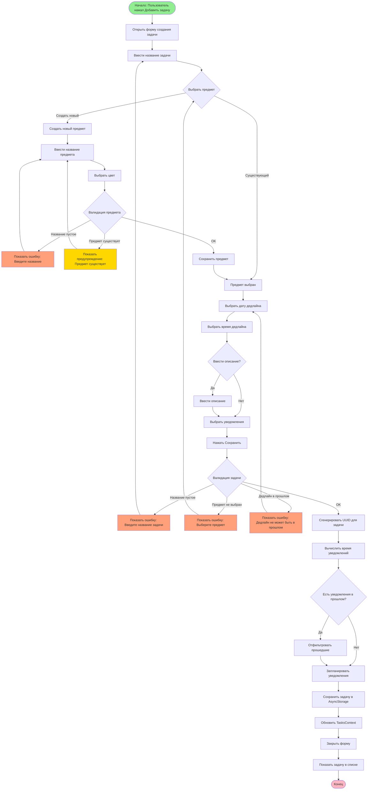
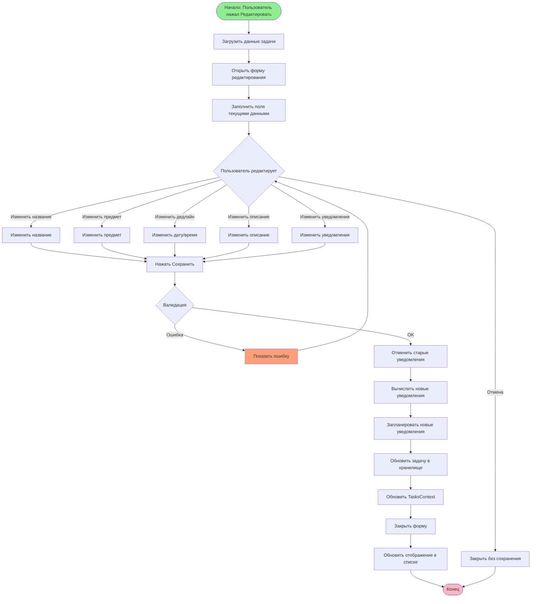
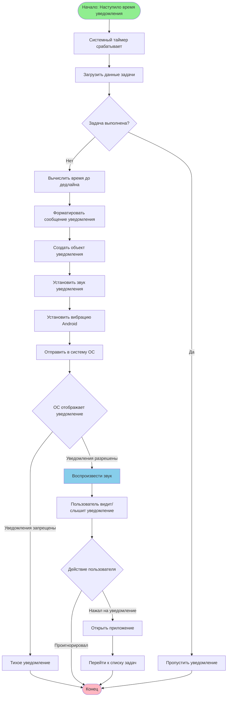
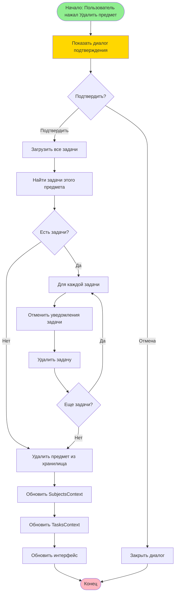
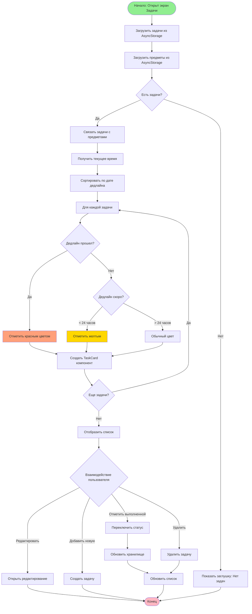
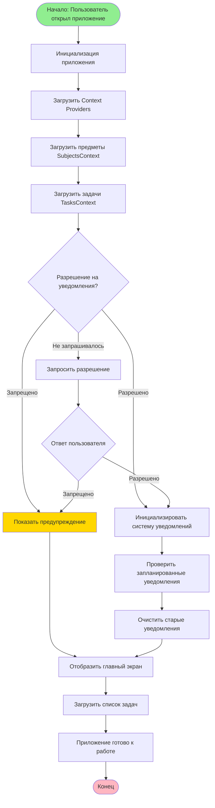
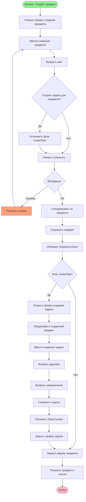

# Activity Диаграммы
## StudentCounter - Диаграммы активностей

---

## 1. Создание задачи

---

## 2. Редактирование задачи

---

## 3. Отправка уведомления

---

## 4. Удаление предмета

---

## 5. Просмотр списка задач

---

## 6. Запуск приложения

---

## 7. Создание предмета с задачей

---

**Конец документа**
