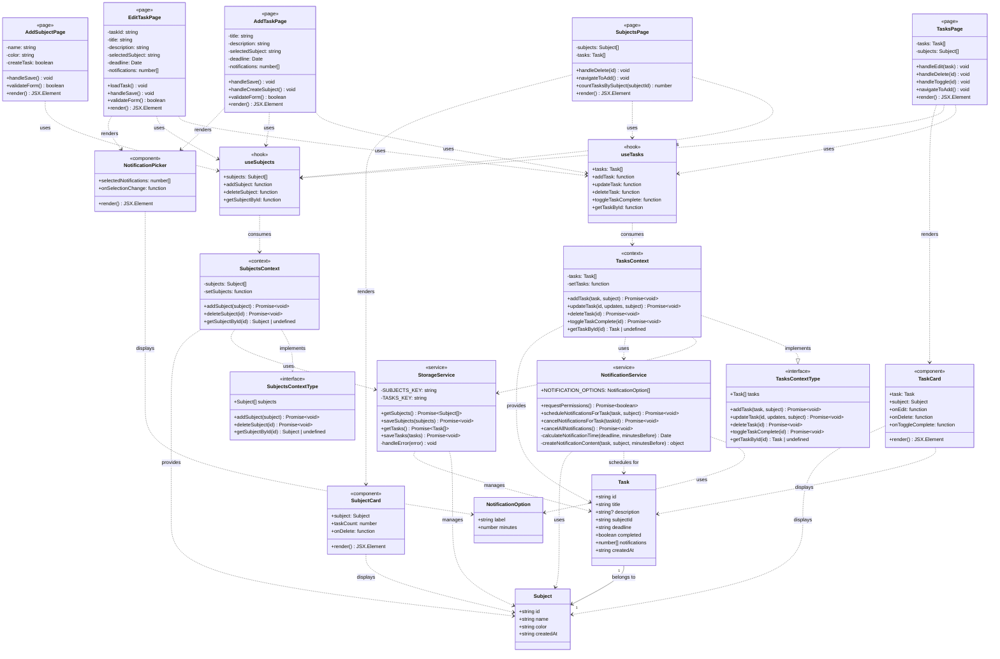

# Class Диаграмма
## StudentCounter - Диаграмма классов



---

## Описание классов

### 1. Типы данных (Types)

#### Subject
**Описание:** Представляет учебный предмет (дисциплину).

**Атрибуты:**
- `id: string` - Уникальный идентификатор (UUID)
- `name: string` - Название предмета
- `color: string` - Цвет для визуальной идентификации (hex-формат)
- `createdAt: string` - Дата создания (ISO 8601)

**Бизнес-правила:**
- ID генерируется автоматически при создании
- Название должно быть уникальным
- Цвет выбирается из предопределенной палитры

#### Task
**Описание:** Представляет учебную задачу с дедлайном.

**Атрибуты:**
- `id: string` - Уникальный идентификатор (UUID)
- `title: string` - Название задачи
- `description?: string` - Описание задачи (опционально)
- `subjectId: string` - ID предмета (внешний ключ)
- `deadline: string` - Дата и время дедлайна (ISO 8601)
- `completed: boolean` - Статус выполнения
- `notifications: number[]` - Массив интервалов уведомлений в минутах
- `createdAt: string` - Дата создания (ISO 8601)

**Бизнес-правила:**
- ID генерируется автоматически при создании
- Дедлайн должен быть в будущем
- Может иметь несколько уведомлений
- Связана ровно с одним предметом

#### NotificationOption
**Описание:** Опция для выбора времени уведомления.

**Атрибуты:**
- `label: string` - Текстовое описание (например, "7 дней")
- `minutes: number` - Количество минут до дедлайна

---

### 2. Сервисы (Services)

#### StorageService
**Описание:** Сервис для работы с локальным хранилищем данных (AsyncStorage).

**Константы:**
- `SUBJECTS_KEY = '@studentcounter:subjects'` - Ключ для предметов
- `TASKS_KEY = '@studentcounter:tasks'` - Ключ для задач

**Методы:**
- `getSubjects(): Promise<Subject[]>` - Загрузить все предметы
- `saveSubjects(subjects: Subject[]): Promise<void>` - Сохранить предметы
- `getTasks(): Promise<Task[]>` - Загрузить все задачи
- `saveTasks(tasks: Task[]): Promise<void>` - Сохранить задачи
- `handleError(error: any): void` - Обработка ошибок

**Зависимости:** AsyncStorage API

#### NotificationService
**Описание:** Сервис для работы с системой уведомлений.

**Константы:**
- `NOTIFICATION_OPTIONS: NotificationOption[]` - Список доступных интервалов

**Методы:**
- `requestPermissions(): Promise<boolean>` - Запросить разрешение на уведомления
- `scheduleNotificationsForTask(task: Task, subject: Subject): Promise<void>` - Запланировать уведомления для задачи
- `cancelNotificationsForTask(taskId: string): Promise<void>` - Отменить уведомления задачи
- `cancelAllNotifications(): Promise<void>` - Отменить все уведомления
- `calculateNotificationTime(deadline: Date, minutesBefore: number): Date` - Вычислить время уведомления
- `createNotificationContent(task: Task, subject: Subject, minutesBefore: number): object` - Создать контент уведомления

**Зависимости:** Expo Notifications API

---

### 3. Контексты (Contexts)

#### SubjectsContext
**Описание:** React Context для управления состоянием предметов.

**Состояние:**
- `subjects: Subject[]` - Массив всех предметов

**Методы:**
- `addSubject(subject: Omit<Subject, 'id' | 'createdAt'>): Promise<void>` - Добавить новый предмет
- `deleteSubject(id: string): Promise<void>` - Удалить предмет
- `getSubjectById(id: string): Subject | undefined` - Получить предмет по ID

**Ответственность:**
- Загрузка предметов при инициализации
- Синхронизация с StorageService
- Обновление UI при изменениях

#### TasksContext
**Описание:** React Context для управления состоянием задач.

**Состояние:**
- `tasks: Task[]` - Массив всех задач

**Методы:**
- `addTask(task: Omit<Task, 'id' | 'createdAt'>, subject: Subject): Promise<void>` - Добавить новую задачу
- `updateTask(id: string, updates: Partial<Task>, subject: Subject): Promise<void>` - Обновить задачу
- `deleteTask(id: string): Promise<void>` - Удалить задачу
- `toggleTaskComplete(id: string): Promise<void>` - Переключить статус выполнения
- `getTaskById(id: string): Task | undefined` - Получить задачу по ID

**Ответственность:**
- Загрузка задач при инициализации
- Синхронизация с StorageService
- Планирование/отмена уведомлений через NotificationService
- Обновление UI при изменениях

---

### 4. Хуки (Hooks)

#### useSubjects
**Описание:** Кастомный хук для работы с предметами.

**Возвращаемые значения:**
- `subjects: Subject[]` - Список предметов
- `addSubject: function` - Добавить предмет
- `deleteSubject: function` - Удалить предмет
- `getSubjectById: function` - Получить предмет

**Использование:**
```typescript
const { subjects, addSubject, deleteSubject } = useSubjects();
```

#### useTasks
**Описание:** Кастомный хук для работы с задачами.

**Возвращаемые значения:**
- `tasks: Task[]` - Список задач
- `addTask: function` - Добавить задачу
- `updateTask: function` - Обновить задачу
- `deleteTask: function` - Удалить задачу
- `toggleTaskComplete: function` - Переключить выполнение
- `getTaskById: function` - Получить задачу

**Использование:**
```typescript
const { tasks, addTask, updateTask, deleteTask } = useTasks();
```

---

### 5. Компоненты (Components)

#### TaskCard
**Описание:** Компонент карточки задачи для отображения в списке.

**Props:**
- `task: Task` - Данные задачи
- `subject: Subject` - Данные предмета
- `onEdit: (task: Task) => void` - Обработчик редактирования
- `onDelete: (id: string) => void` - Обработчик удаления
- `onToggleComplete: (id: string) => void` - Обработчик переключения статуса

**Отображаемая информация:**
- Название задачи
- Название и цвет предмета
- Дата и время дедлайна
- Индикаторы уведомлений
- Чекбокс выполнения
- Кнопки редактирования и удаления

**Визуальные состояния:**
- Просроченная (красный)
- Скоро дедлайн (желтый)
- Обычная (белый/серый)
- Выполненная (зачеркнутая)

#### SubjectCard
**Описание:** Компонент карточки предмета для отображения в списке.

**Props:**
- `subject: Subject` - Данные предмета
- `taskCount: number` - Количество активных задач
- `onDelete: (id: string) => void` - Обработчик удаления

**Отображаемая информация:**
- Название предмета
- Цветовой индикатор
- Счетчик задач
- Кнопка удаления

#### NotificationPicker
**Описание:** Компонент для выбора временных интервалов уведомлений.

**Props:**
- `selectedNotifications: number[]` - Выбранные интервалы
- `onSelectionChange: (notifications: number[]) => void` - Обработчик изменения

**Функциональность:**
- Отображение всех доступных интервалов
- Множественный выбор
- Визуальная индикация выбранных элементов

---

### 6. Страницы (Pages)

#### TasksPage (app/(tabs)/index.tsx)
**Описание:** Главная страница со списком задач.

**Состояние:**
- Список задач из TasksContext
- Список предметов из SubjectsContext

**Функциональность:**
- Отображение списка задач
- Сортировка по дате дедлайна
- Переход к редактированию
- Удаление задачи
- Переключение статуса выполнения
- Навигация к созданию задачи

#### SubjectsPage (app/(tabs)/subjects.tsx)
**Описание:** Страница со списком предметов.

**Состояние:**
- Список предметов из SubjectsContext
- Список задач для подсчета

**Функциональность:**
- Отображение списка предметов
- Подсчет задач по каждому предмету
- Удаление предмета
- Навигация к созданию предмета

#### AddTaskPage (app/add-task.tsx)
**Описание:** Модальная страница создания задачи.

**Состояние:**
- `title: string` - Название задачи
- `description: string` - Описание
- `selectedSubject: string` - ID выбранного предмета
- `deadline: Date` - Дедлайн
- `notifications: number[]` - Выбранные уведомления

**Функциональность:**
- Форма ввода данных задачи
- Выбор или создание предмета
- Выбор даты и времени
- Выбор уведомлений
- Валидация формы
- Сохранение задачи

#### EditTaskPage (app/edit-task.tsx)
**Описание:** Модальная страница редактирования задачи.

**Состояние:**
- `taskId: string` - ID редактируемой задачи
- Остальные поля аналогично AddTaskPage

**Функциональность:**
- Загрузка данных задачи
- Редактирование всех полей
- Валидация формы
- Сохранение изменений

#### AddSubjectPage (app/add-subject.tsx)
**Описание:** Модальная страница создания предмета.

**Состояние:**
- `name: string` - Название предмета
- `color: string` - Выбранный цвет
- `createTask: boolean` - Флаг создания задачи

**Функциональность:**
- Форма ввода данных предмета
- Выбор цвета
- Опция создания задачи для предмета
- Валидация формы
- Сохранение предмета
- Переход к созданию задачи (опционально)

---

## Паттерны проектирования

### 1. Layered Architecture (Слоистая архитектура)
- **Presentation Layer:** Components, Pages
- **Business Logic Layer:** Hooks, Contexts
- **Data Access Layer:** Services

### 2. Repository Pattern
- `StorageService` абстрагирует работу с AsyncStorage
- Централизованное управление данными

### 3. Provider Pattern
- React Context API для глобального состояния
- `SubjectsProvider`, `TasksProvider`

### 4. Custom Hooks Pattern
- `useSubjects`, `useTasks` инкапсулируют логику

### 5. Composition Pattern
- Компоненты составляются из меньших компонентов
- Переиспользуемые UI элементы

### 6. Service Layer Pattern
- Сервисы инкапсулируют бизнес-логику
- Независимы от UI

---

**Конец документа**
