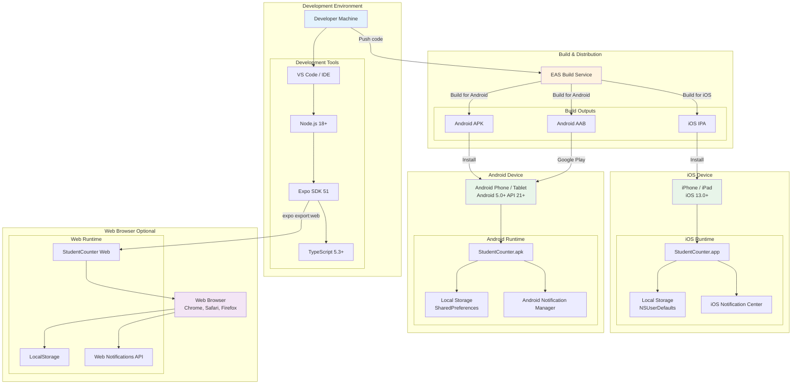
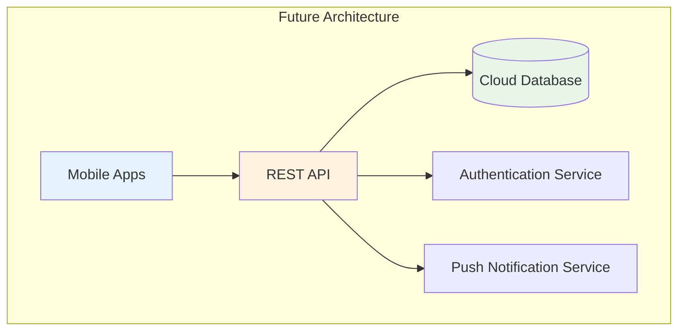

# Component и Deployment Диаграммы
## StudentCounter - Диаграммы компонентов и развертывания

---

## 1. Component Диаграмма

```mermaid
graph TB
    subgraph "Presentation Layer"
        AppComp[App Component<br/>app/_layout.tsx]
        TabsComp[Tabs Layout<br/>app/tabs/_layout.tsx]
        TasksPage[Tasks Page<br/>app/tabs/index.tsx]
        SubjectsPage[Subjects Page<br/>app/tabs/subjects.tsx]
        AddTaskPage[Add Task Page<br/>app/add-task.tsx]
        EditTaskPage[Edit Task Page<br/>app/edit-task.tsx]
        AddSubjectPage[Add Subject Page<br/>app/add-subject.tsx]
        
        TaskCard[TaskCard Component<br/>components/TaskCard.tsx]
        SubjectCard[SubjectCard Component<br/>components/SubjectCard.tsx]
        NotifPicker[NotificationPicker Component<br/>components/NotificationPicker.tsx]
    end
    
    subgraph "Business Logic Layer"
        SubjContext[SubjectsContext<br/>contexts/SubjectsContext.tsx]
        TaskContext[TasksContext<br/>contexts/TasksContext.tsx]
        
        UseSubjects[useSubjects Hook<br/>hooks/useSubjects.tsx]
        UseTasks[useTasks Hook<br/>hooks/useTasks.tsx]
    end
    
    subgraph "Service Layer"
        StorageService[Storage Service<br/>services/storage.service.ts]
        NotifService[Notification Service<br/>services/notification.service.ts]
    end
    
    subgraph "Data Layer"
        Types[Type Definitions<br/>constants/types.ts]
        Theme[Theme Constants<br/>constants/theme.ts]
    end
    
    subgraph "External Dependencies"
        AsyncStorage[AsyncStorage<br/>@react-native-async-storage/async-storage]
        ExpoNotif[Expo Notifications<br/>expo-notifications]
        ExpoRouter[Expo Router<br/>expo-router]
        ReactNative[React Native<br/>react-native]
    end
    
    %% App Structure
    AppComp --> SubjContext
    AppComp --> TaskContext
    AppComp --> TabsComp
    
    TabsComp --> TasksPage
    TabsComp --> SubjectsPage
    
    AppComp --> AddTaskPage
    AppComp --> EditTaskPage
    AppComp --> AddSubjectPage
    
    %% Pages use hooks
    TasksPage --> UseTasks
    TasksPage --> UseSubjects
    TasksPage --> TaskCard
    
    SubjectsPage --> UseSubjects
    SubjectsPage --> UseTasks
    SubjectsPage --> SubjectCard
    
    AddTaskPage --> UseTasks
    AddTaskPage --> UseSubjects
    AddTaskPage --> NotifPicker
    
    EditTaskPage --> UseTasks
    EditTaskPage --> UseSubjects
    EditTaskPage --> NotifPicker
    
    AddSubjectPage --> UseSubjects
    
    %% Hooks consume contexts
    UseSubjects --> SubjContext
    UseTasks --> TaskContext
    
    %% Contexts use services
    SubjContext --> StorageService
    TaskContext --> StorageService
    TaskContext --> NotifService
    
    %% Services use external deps
    StorageService --> AsyncStorage
    NotifService --> ExpoNotif
    
    %% All use types
    Types -.-> TasksPage
    Types -.-> SubjectsPage
    Types -.-> AddTaskPage
    Types -.-> EditTaskPage
    Types -.-> AddSubjectPage
    Types -.-> SubjContext
    Types -.-> TaskContext
    Types -.-> StorageService
    Types -.-> NotifService
    
    %% Theme usage
    Theme -.-> TaskCard
    Theme -.-> SubjectCard
    Theme -.-> NotifPicker
    Theme -.-> TasksPage
    Theme -.-> SubjectsPage
    
    %% Navigation
    ExpoRouter -.-> AppComp
    ExpoRouter -.-> TabsComp
    ExpoRouter -.-> TasksPage
    ExpoRouter -.-> SubjectsPage
    
    %% UI
    ReactNative -.-> TaskCard
    ReactNative -.-> SubjectCard
    ReactNative -.-> NotifPicker
    
    style AppComp fill:#E3F2FD
    style TabsComp fill:#E3F2FD
    style TasksPage fill:#E3F2FD
    style SubjectsPage fill:#E3F2FD
    style AddTaskPage fill:#E3F2FD
    style EditTaskPage fill:#E3F2FD
    style AddSubjectPage fill:#E3F2FD
    
    style SubjContext fill:#FFF3E0
    style TaskContext fill:#FFF3E0
    style UseSubjects fill:#FFF3E0
    style UseTasks fill:#FFF3E0
    
    style StorageService fill:#E8F5E9
    style NotifService fill:#E8F5E9
    
    style Types fill:#F3E5F5
    style Theme fill:#F3E5F5
```

---

## 2. Deployment Диаграмма



---

## 3. Физическая архитектура

### Узлы (Nodes)

#### 1. Developer Machine
**Тип:** Рабочая станция разработчика  
**ОС:** Windows / macOS / Linux  
**Требования:**
- Node.js 18.0+
- npm или yarn
- Git
- Expo CLI
- TypeScript 5.3+

**Роль:**
- Разработка кода
- Локальное тестирование
- Сборка проекта
- Управление версиями

#### 2. EAS Build Service
**Тип:** Облачный сервис сборки  
**Провайдер:** Expo  
**Роль:**
- Компиляция нативных приложений
- Генерация APK/AAB для Android
- Генерация IPA для iOS
- Управление сертификатами

#### 3. iOS Device
**Тип:** Мобильное устройство  
**Платформа:** iOS 13.0+  
**Устройства:** iPhone, iPad  
**Компоненты:**
- **StudentCounter.app** - Нативное приложение
- **NSUserDefaults** - Хранилище данных (AsyncStorage backend)
- **iOS Notification Center** - Система уведомлений
- **Local File System** - Файловое хранилище

#### 4. Android Device
**Тип:** Мобильное устройство  
**Платформа:** Android 5.0+ (API level 21+)  
**Устройства:** Android phones, tablets  
**Компоненты:**
- **StudentCounter.apk** - Нативное приложение
- **SharedPreferences** - Хранилище данных (AsyncStorage backend)
- **Android Notification Manager** - Система уведомлений
- **Local File System** - Файловое хранилище

#### 5. Web Browser (Optional)
**Тип:** Веб-браузер  
**Поддержка:** Chrome, Safari, Firefox, Edge  
**Компоненты:**
- **StudentCounter Web** - Веб-версия приложения
- **LocalStorage** - Хранилище данных
- **Web Notifications API** - Уведомления браузера

---

## 4. Компонентная структура файлов

### Артефакты проекта

```
StudentCounter/
├── 📦 Source Code
│   ├── app/                     # Expo Router pages
│   │   ├── (tabs)/
│   │   │   ├── _layout.tsx      # Tab navigator
│   │   │   ├── index.tsx        # Tasks screen
│   │   │   └── subjects.tsx     # Subjects screen
│   │   ├── _layout.tsx          # Root layout
│   │   ├── add-task.tsx         # Add task modal
│   │   ├── edit-task.tsx        # Edit task modal
│   │   └── add-subject.tsx      # Add subject modal
│   │
│   ├── components/              # UI components
│   │   ├── TaskCard.tsx
│   │   ├── SubjectCard.tsx
│   │   ├── NotificationPicker.tsx
│   │   └── index.ts
│   │
│   ├── contexts/                # React contexts
│   │   ├── SubjectsContext.tsx
│   │   └── TasksContext.tsx
│   │
│   ├── hooks/                   # Custom hooks
│   │   ├── useSubjects.tsx
│   │   └── useTasks.tsx
│   │
│   ├── services/                # Business services
│   │   ├── storage.service.ts
│   │   └── notification.service.ts
│   │
│   └── constants/               # Constants & types
│       ├── types.ts
│       └── theme.ts
│
├── 📱 Build Outputs
│   ├── android/
│   │   ├── app-release.apk      # Android installable
│   │   └── app-release.aab      # Google Play bundle
│   │
│   ├── ios/
│   │   └── StudentCounter.ipa   # iOS installable
│   │
│   └── web/
│       └── dist/                # Web bundle
│
├── 📄 Configuration Files
│   ├── app.json                 # Expo configuration
│   ├── tsconfig.json            # TypeScript config
│   ├── package.json             # Dependencies
│   └── babel.config.js          # Babel config
│
└── 📚 Documentation
    ├── README.md
    ├── docs/
    │   ├── SRS.md
    │   ├── TestPlan.md
    │   ├── TestResults.md
    │   └── UML/
    │       ├── UseCaseDiagram.md
    │       ├── ActivityDiagrams.md
    │       ├── SequenceDiagrams.md
    │       ├── StateDiagrams.md
    │       ├── ClassDiagram.md
    │       └── ComponentDeployment.md
```

---

## 5. Зависимости компонентов

### Критические зависимости

```
React Native 0.74+
├── expo ~51.0.0
│   ├── expo-router ~3.5.0          # Навигация
│   ├── expo-notifications ~0.28.0   # Уведомления
│   ├── expo-image ~1.12.0          # Оптимизированные изображения
│   └── expo-constants ~16.0.0      # Константы
│
├── @react-native-async-storage/async-storage ~1.23.0  # Хранилище
├── react-native-safe-area-context ~4.10.0             # Safe area
├── react-native-screens ~3.31.0                       # Навигация
└── @expo/vector-icons ~14.0.0                        # Иконки

TypeScript 5.3+
└── @types/*                        # Type definitions
```

### Опциональные зависимости

```
Development:
├── eslint                          # Линтер
├── prettier                        # Форматирование
└── jest                           # Тестирование
```

---

## 6. Deployment процесс

### 1. Development
```bash
npm install              # Установка зависимостей
npm start               # Запуск Expo Dev Server
```

### 2. Local Testing
```bash
expo start --ios        # iOS Simulator
expo start --android    # Android Emulator
expo start --web        # Web Browser
```

### 3. Build для Production
```bash
eas build --platform ios       # iOS build
eas build --platform android   # Android build
eas build --platform all       # Оба
```

### 4. Distribution

**iOS:**
```bash
eas submit --platform ios      # Submit to App Store
```

**Android:**
```bash
eas submit --platform android  # Submit to Google Play
# или
adb install app-release.apk   # Прямая установка
```

**Web:**
```bash
expo export:web                # Экспорт статики
# Deploy to hosting (Vercel, Netlify, etc.)
```

---

## 7. Системные требования

### Минимальные требования устройств

#### iOS
- **Версия ОС:** iOS 13.0+
- **Устройства:** iPhone 6S и новее, iPad Air 2 и новее
- **Память:** 100 MB свободного места
- **Разрешения:** Уведомления

#### Android
- **Версия ОС:** Android 5.0 (API level 21+)
- **Архитектура:** ARM, ARM64, x86, x86_64
- **Память:** 100 MB свободного места
- **Разрешения:** Уведомления, Хранилище

#### Web
- **Браузеры:** Chrome 90+, Safari 14+, Firefox 88+, Edge 90+
- **JavaScript:** Enabled
- **Local Storage:** Enabled
- **Notifications:** Supported (опционально)

---

## 8. Масштабируемость

### Текущая архитектура
- **Одно устройство** - один пользователь
- **Локальное хранилище** - данные на устройстве
- **Офлайн-первый** - полная автономность

### Будущее масштабирование (опционально)



**Возможные улучшения:**
- Cloud sync между устройствами
- Мультипользовательский режим
- Веб-версия с полной синхронизацией
- Облачное резервное копирование
- Совместная работа над задачами

---

**Конец документа**
