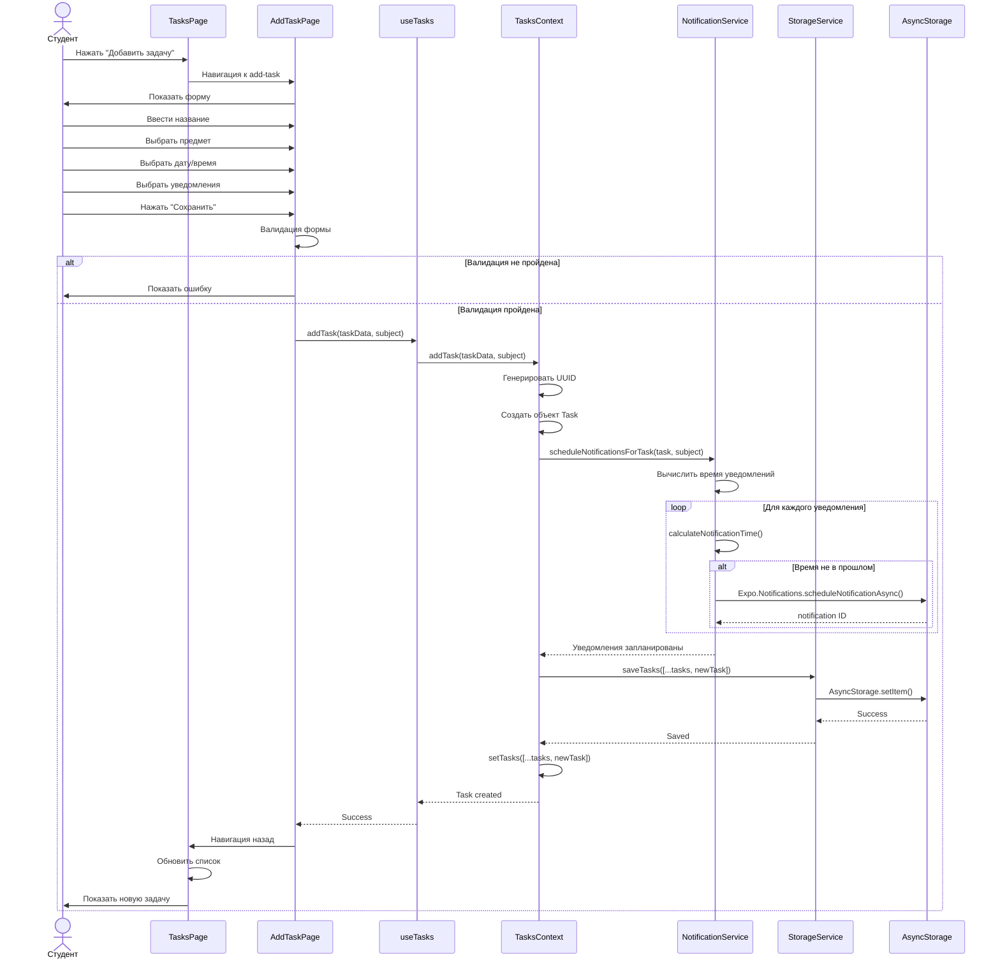
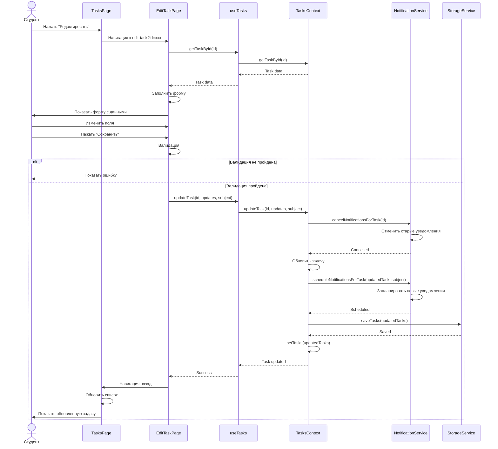
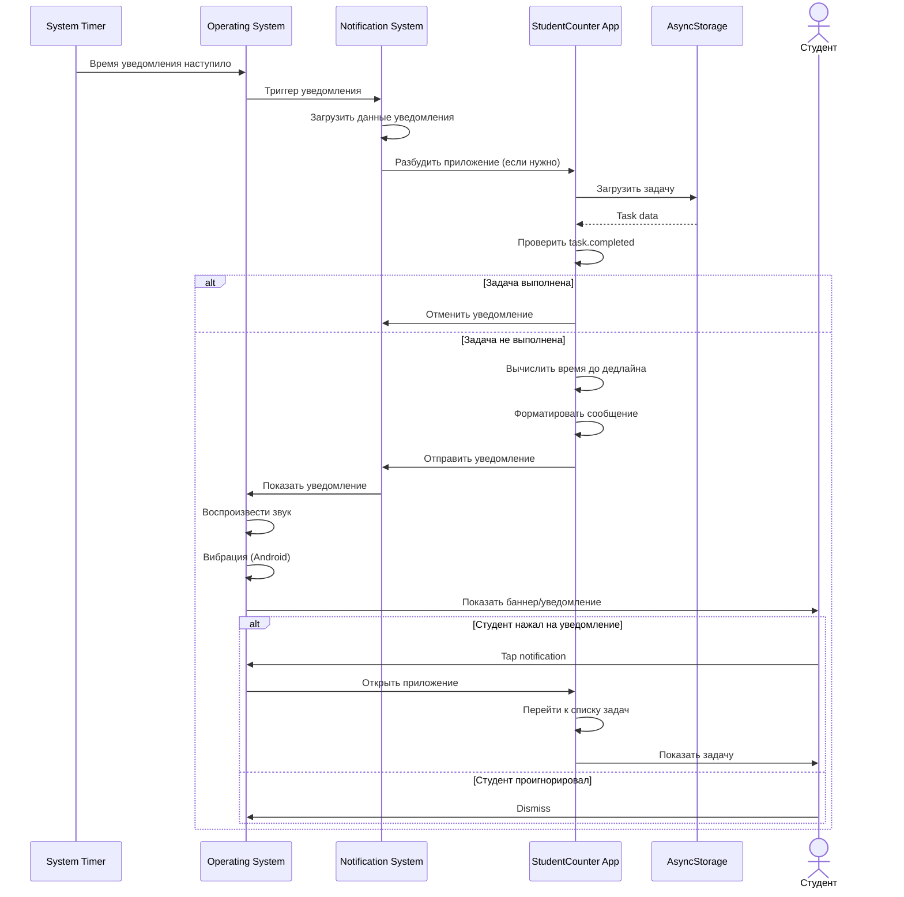
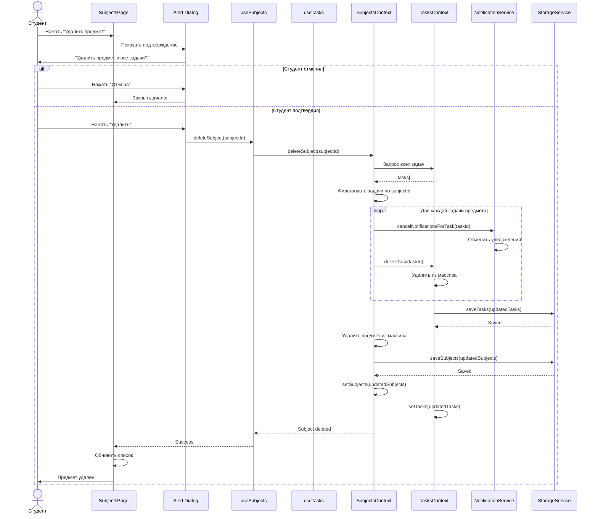
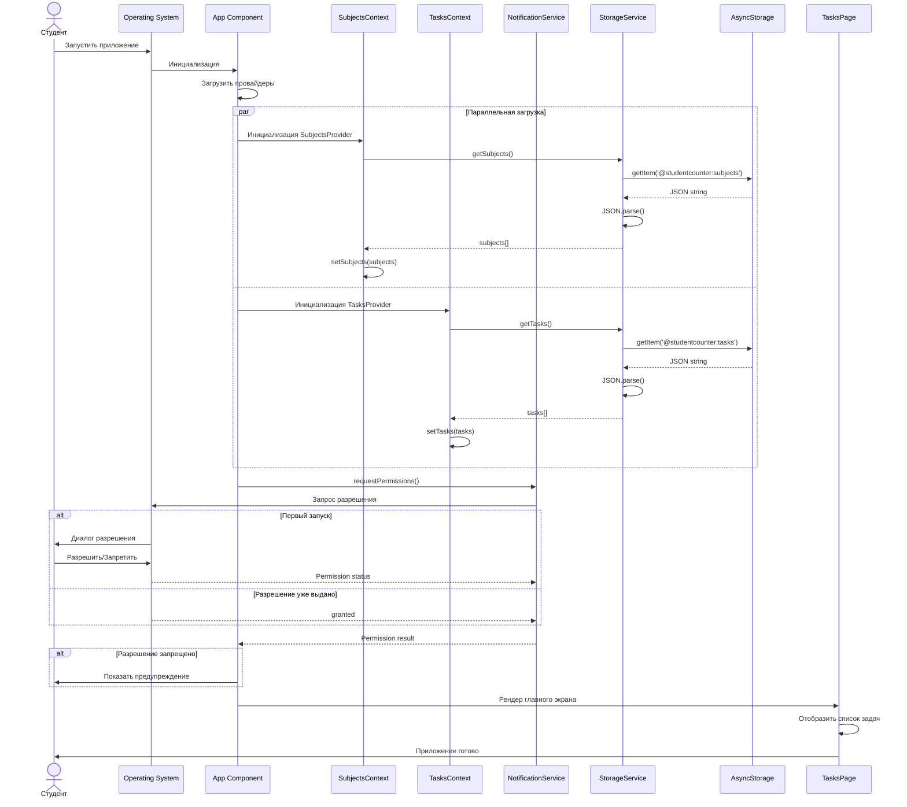
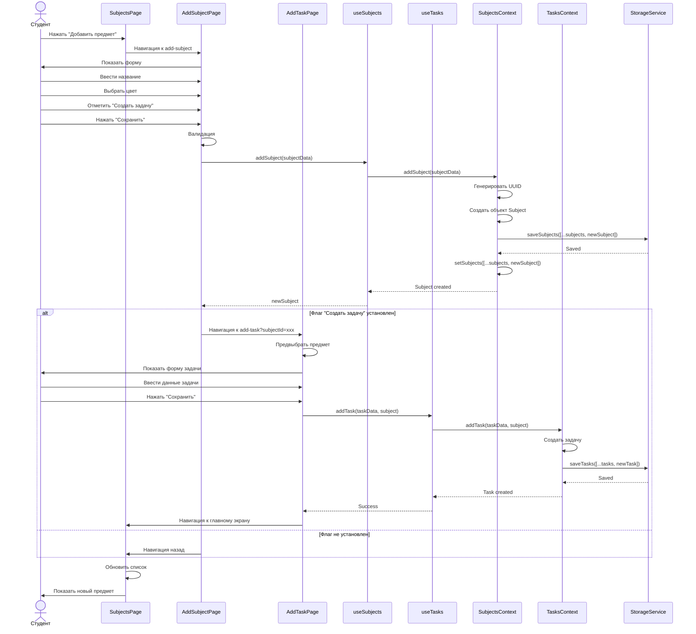
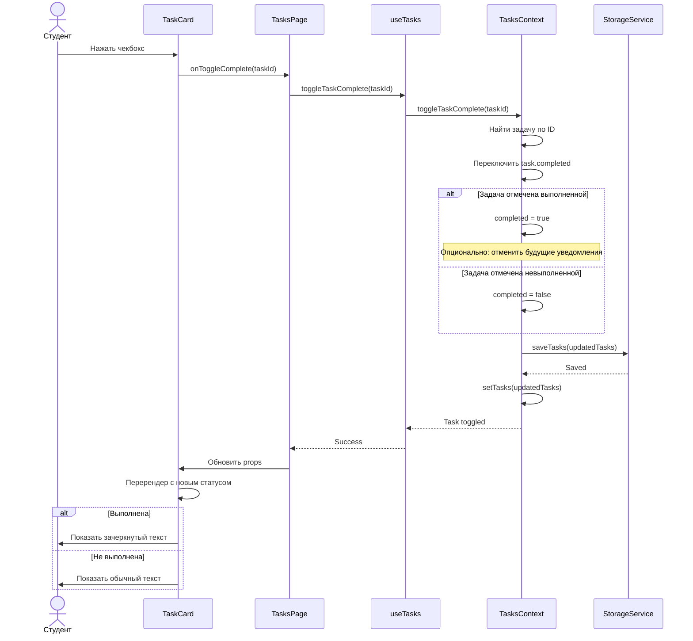

# Sequence Диаграммы
## StudentCounter - Диаграммы последовательности

---

## 1. Создание задачи

---

## 2. Редактирование задачи

---

## 3. Отправка уведомления

---

## 4. Удаление предмета с задачами

---

## 5. Запуск приложения и загрузка данных

---

## 6. Создание предмета с задачей

---

## 7. Переключение статуса выполнения задачи

---

## Ключевые взаимодействия

### Паттерны взаимодействия

1. **UI → Hook → Context → Service → Storage**
   - Стандартный поток для операций с данными
   - Разделение ответственности между слоями

2. **Context координирует несколько сервисов**
   - TasksContext использует StorageService + NotificationService
   - Атомарные операции (сохранение + планирование уведомлений)

3. **Асинхронные операции**
   - Все операции с хранилищем асинхронные
   - Использование Promise для обработки результатов

4. **Двусторонняя связь Context ↔ UI**
   - Context обновляет состояние
   - UI автоматически ререндерится через React

5. **Система уведомлений работает независимо**
   - ОС триггерит уведомления по расписанию
   - Приложение может быть закрыто

---

**Конец документа**
