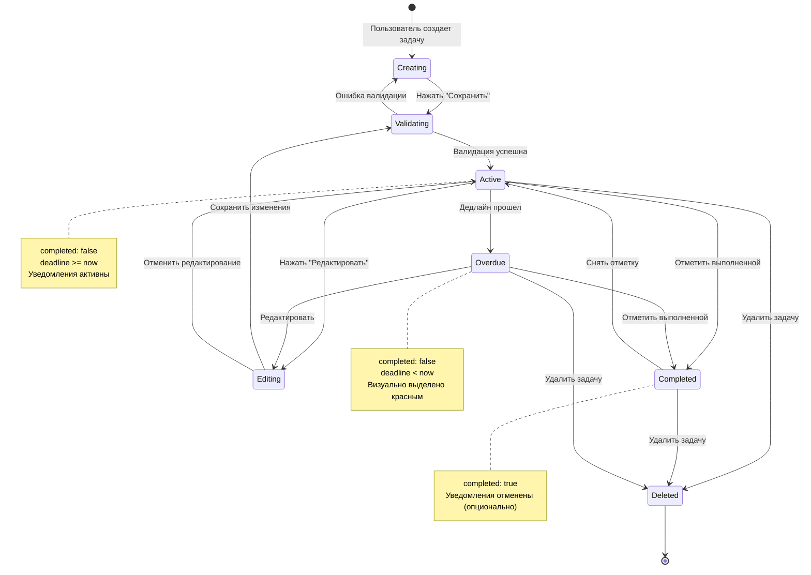
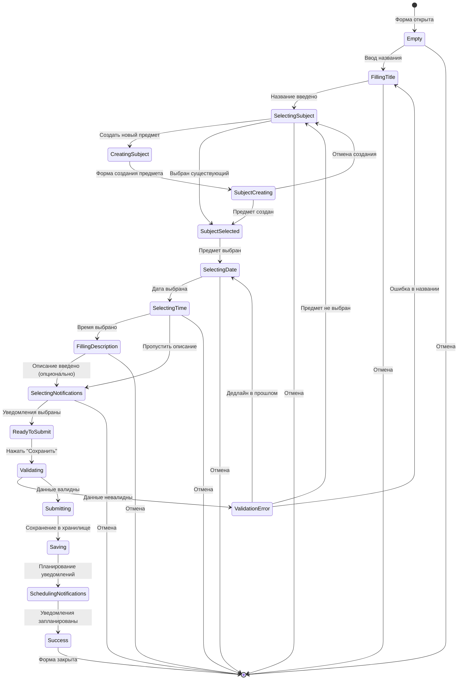
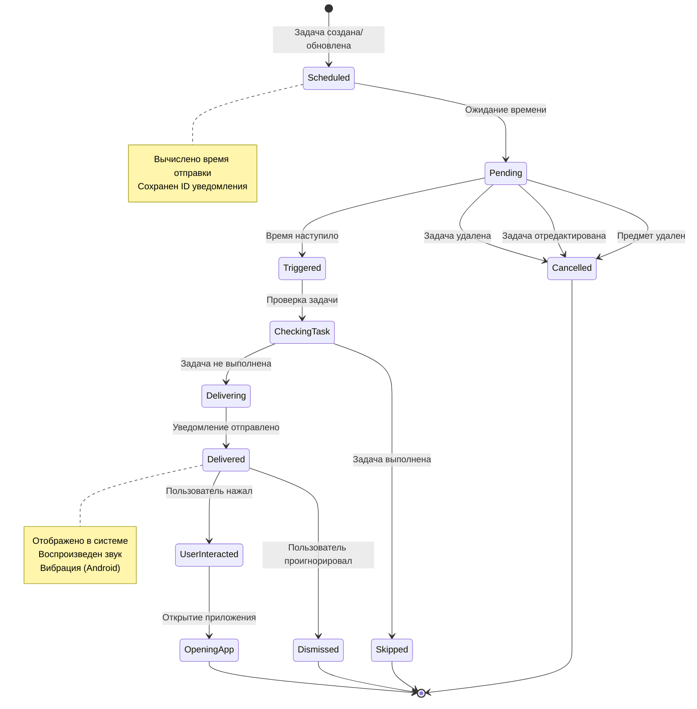
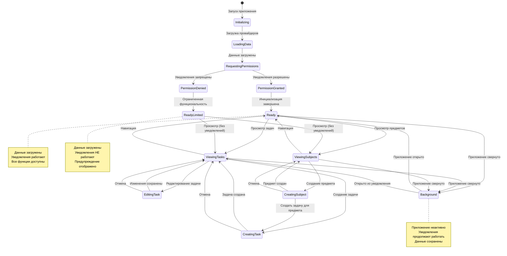
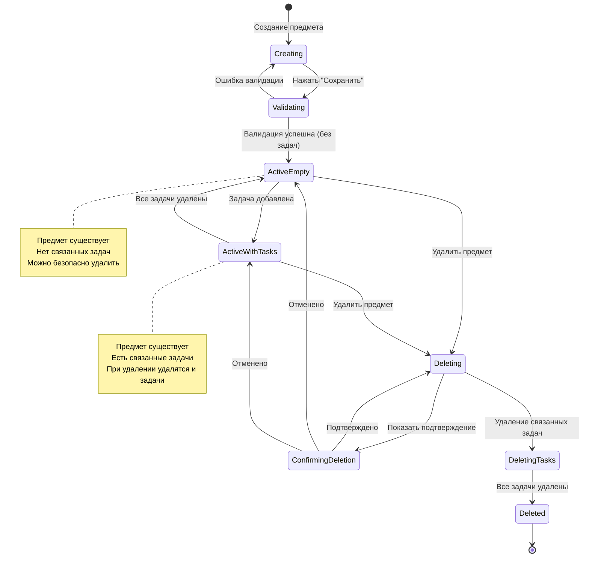
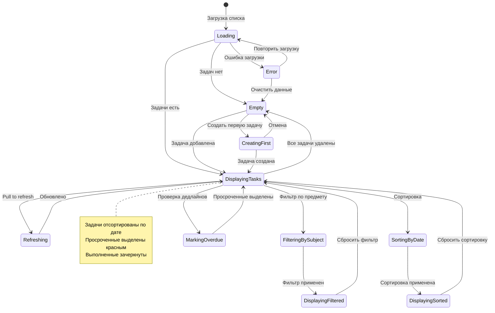

# State Диаграммы
## StudentCounter - Диаграммы состояний

---

## 1. Состояния задачи (Task State)

---

## 2. Состояния формы создания задачи (Add Task Form State)

---

## 3. Состояния уведомления (Notification State)

---

## 4. Состояния приложения (Application State)

---

## 5. Состояния предмета (Subject State)

---

## 6. Состояния списка задач (Task List View State)

---

## Условия переходов (Guards)

### Валидация задачи
- **title.length > 0** - Название не пустое
- **subjectId !== null** - Предмет выбран
- **deadline > now()** - Дедлайн в будущем
- **notifications.length >= 0** - Уведомления валидны (может быть пустым)

### Валидация предмета
- **name.length > 0** - Название не пустое
- **!subjects.find(s => s.name === name)** - Имя уникально
- **color.match(/^#[0-9A-F]{6}$/i)** - Валидный hex-цвет

### Проверка разрешений
- **Notification.requestPermissionsAsync()** - Запрос разрешения
- **status === 'granted'** - Разрешение выдано

### Проверка времени
- **task.deadline < Date.now()** - Дедлайн прошел
- **notification.time <= Date.now()** - Время уведомления наступило

---

## События (Events)

### Пользовательские действия
- `CREATE_TASK` - Создать задачу
- `EDIT_TASK` - Редактировать задачу
- `DELETE_TASK` - Удалить задачу
- `TOGGLE_COMPLETE` - Переключить выполнение
- `CREATE_SUBJECT` - Создать предмет
- `DELETE_SUBJECT` - Удалить предмет
- `SAVE_FORM` - Сохранить форму
- `CANCEL_FORM` - Отменить форму

### Системные события
- `APP_STARTED` - Приложение запущено
- `DATA_LOADED` - Данные загружены
- `PERMISSION_GRANTED` - Разрешение выдано
- `PERMISSION_DENIED` - Разрешение отклонено
- `NOTIFICATION_TRIGGERED` - Уведомление сработало
- `APP_BACKGROUNDED` - Приложение свернуто
- `APP_FOREGROUNDED` - Приложение развернуто

### Таймерные события
- `DEADLINE_PASSED` - Дедлайн прошел
- `NOTIFICATION_TIME` - Время уведомления
- `CHECK_OVERDUE` - Проверка просроченных

---

**Конец документа**
