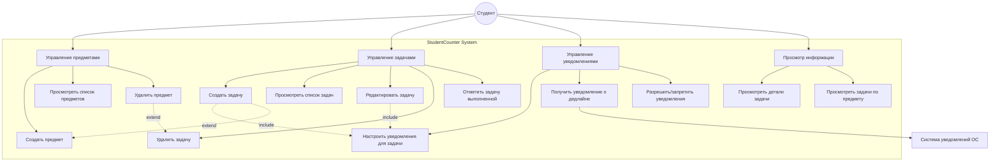

# Use Case Диаграмма
## StudentCounter - Диаграмма вариантов использования

---

## Описание актеров

### Студент
**Описание:** Основной пользователь системы - студент учебного заведения, который использует приложение для управления учебными задачами и дедлайнами.

**Цели:**
- Организовать учебный процесс
- Не пропустить сроки сдачи работ
- Эффективно планировать время
- Получать своевременные напоминания

**Характеристики:**
- Использует мобильное устройство (iOS или Android)
- Имеет несколько учебных предметов
- Выполняет различные виды заданий (лабораторные, проекты, контрольные)

---

## Описание вариантов использования

### UC1: Управление предметами

#### UC1.1: Создать предмет
**Приоритет:** Высокий  
**Актеры:** Студент  
**Предусловия:** Приложение запущено  
**Постусловия:** Новый предмет добавлен в систему

**Основной поток:**
1. Студент открывает экран "Предметы"
2. Студент нажимает кнопку "Добавить предмет"
3. Система отображает форму создания предмета
4. Студент вводит название предмета
5. Студент выбирает цвет для предмета
6. Студент (опционально) отмечает "Создать задачу для этого предмета"
7. Студент нажимает "Сохранить"
8. Система валидирует данные
9. Система сохраняет предмет
10. Система отображает предмет в списке
11. Если выбрано создание задачи - переход к UC2.1

**Альтернативные потоки:**
- 8a. Название предмета пустое
  - Система показывает ошибку "Введите название предмета"
  - Возврат к шагу 4
- 8b. Предмет с таким названием уже существует
  - Система показывает предупреждение
  - Студент может изменить название или отменить создание

#### UC1.2: Просмотреть список предметов
**Приоритет:** Высокий  
**Актеры:** Студент  
**Предусловия:** Приложение запущено  
**Постусловия:** Отображен список предметов

**Основной поток:**
1. Студент переходит на вкладку "Предметы"
2. Система загружает список предметов из хранилища
3. Система отображает карточки предметов с:
   - Названием
   - Цветом
   - Количеством активных задач
4. Студент может просмотреть список

**Альтернативные потоки:**
- 2a. Список предметов пуст
  - Система показывает заглушку "Нет предметов"
  - Предложение создать первый предмет

#### UC1.3: Удалить предмет
**Приоритет:** Средний  
**Актеры:** Студент  
**Предусловия:** Существует хотя бы один предмет  
**Постусловия:** Предмет и связанные задачи удалены

**Основной поток:**
1. Студент открывает список предметов (UC1.2)
2. Студент нажимает кнопку удаления на карточке предмета
3. Система показывает диалог подтверждения
4. Студент подтверждает удаление
5. Система удаляет предмет
6. Система удаляет все задачи связанные с предметом (UC2.4)
7. Система отменяет все уведомления связанных задач
8. Система обновляет список предметов

**Альтернативные потоки:**
- 4a. Студент отменяет удаление
  - Система закрывает диалог
  - Предмет не удаляется

---

### UC2: Управление задачами

#### UC2.1: Создать задачу
**Приоритет:** Критический  
**Актеры:** Студент  
**Предусловия:** Приложение запущено  
**Постусловия:** Новая задача создана, уведомления запланированы

**Основной поток:**
1. Студент нажимает кнопку "Добавить задачу"
2. Система отображает форму создания задачи
3. Студент вводит название задачи
4. Студент выбирает предмет из списка или создает новый
5. Студент выбирает дату дедлайна
6. Студент выбирает время дедлайна
7. Студент (опционально) вводит описание
8. Студент выбирает временные интервалы уведомлений (UC3.1)
9. Студент нажимает "Сохранить"
10. Система валидирует данные
11. Система генерирует уникальный ID для задачи
12. Система сохраняет задачу в хранилище
13. Система планирует уведомления (UC3.1)
14. Система закрывает форму
15. Система отображает задачу в списке

**Альтернативные потоки:**
- 4a. Студент создает новый предмет
  - Выполняется UC1.1 (упрощенная форма)
  - Предмет автоматически выбирается
  - Возврат к шагу 5
- 10a. Название задачи пустое
  - Система показывает ошибку "Введите название задачи"
  - Возврат к шагу 3
- 10b. Дедлайн в прошлом
  - Система показывает ошибку "Дедлайн не может быть в прошлом"
  - Возврат к шагу 5
- 10c. Предмет не выбран
  - Система показывает ошибку "Выберите предмет"
  - Возврат к шагу 4

#### UC2.2: Просмотреть список задач
**Приоритет:** Критический  
**Актеры:** Студент  
**Предусловия:** Приложение запущено  
**Постусловия:** Отображен список задач

**Основной поток:**
1. Студент открывает вкладку "Задачи" (главный экран)
2. Система загружает задачи из хранилища
3. Система загружает предметы для отображения
4. Система сортирует задачи по дате дедлайна
5. Система отображает карточки задач с:
   - Названием задачи
   - Названием и цветом предмета
   - Датой и временем дедлайна
   - Чекбоксом выполнения
   - Индикаторами активных уведомлений
6. Система выделяет просроченные задачи красным цветом
7. Студент просматривает список

**Альтернативные потоки:**
- 2a. Список задач пуст
  - Система показывает заглушку "Нет задач"
  - Предложение создать первую задачу

#### UC2.3: Редактировать задачу
**Приоритет:** Высокий  
**Актеры:** Студент  
**Предусловия:** Существует хотя бы одна задача  
**Постусловия:** Задача обновлена, уведомления перепланированы

**Основной поток:**
1. Студент открывает список задач (UC2.2)
2. Студент нажимает кнопку редактирования на карточке задачи
3. Система загружает данные задачи
4. Система отображает форму редактирования с заполненными полями
5. Студент изменяет нужные поля (название, предмет, дедлайн, описание, уведомления)
6. Студент нажимает "Сохранить"
7. Система валидирует данные
8. Система отменяет старые уведомления
9. Система обновляет задачу в хранилище
10. Система планирует новые уведомления (UC3.1)
11. Система закрывает форму
12. Система обновляет отображение задачи в списке

**Альтернативные потоки:**
- 7a. Данные невалидны (пустое название, дедлайн в прошлом и т.д.)
  - Аналогично UC2.1 шаг 10a-10c
- 6a. Студент нажимает "Отмена"
  - Система закрывает форму без сохранения
  - Изменения отменяются

#### UC2.4: Удалить задачу
**Приоритет:** Средний  
**Актеры:** Студент  
**Предусловия:** Существует хотя бы одна задача  
**Постусловия:** Задача и уведомления удалены

**Основной поток:**
1. Студент открывает список задач (UC2.2)
2. Студент нажимает кнопку удаления на карточке задачи
3. Система показывает диалог подтверждения
4. Студент подтверждает удаление
5. Система отменяет все уведомления задачи
6. Система удаляет задачу из хранилища
7. Система удаляет задачу из списка

**Альтернативные потоки:**
- 4a. Студент отменяет удаление
  - Система закрывает диалог
  - Задача не удаляется

#### UC2.5: Отметить задачу выполненной
**Приоритет:** Высокий  
**Актеры:** Студент  
**Предусловия:** Существует хотя бы одна задача  
**Постусловия:** Статус задачи изменен

**Основной поток:**
1. Студент открывает список задач (UC2.2)
2. Студент нажимает чекбокс на карточке задачи
3. Система переключает статус выполнения
4. Система обновляет задачу в хранилище
5. Система визуально отмечает задачу (зачеркивание, изменение цвета)
6. Система (опционально) отменяет будущие уведомления

**Альтернативные потоки:**
- 2a. Задача уже выполнена
  - Система снимает отметку выполнения
  - Задача возвращается в активные

---

### UC3: Управление уведомлениями

#### UC3.1: Настроить уведомления для задачи
**Приоритет:** Критический  
**Актеры:** Студент  
**Предусловия:** Создание или редактирование задачи  
**Постусловия:** Уведомления запланированы

**Основной поток:**
1. Студент находится в форме создания/редактирования задачи
2. Система отображает список доступных временных интервалов:
   - 14 дней до дедлайна
   - 7 дней до дедлайна
   - 5 дней до дедлайна
   - 3 дня до дедлайна
   - 1 день до дедлайна
   - 12 часов до дедлайна
   - 6 часов до дедлайна
   - 3 часа до дедлайна
   - 1 час до дедлайна
   - 30 минут до дедлайна
   - В момент дедлайна
3. Студент выбирает один или несколько интервалов
4. При сохранении задачи система вычисляет время для каждого уведомления
5. Система планирует уведомления через Expo Notifications API
6. Система сохраняет выбранные интервалы вместе с задачей

**Альтернативные потоки:**
- 4a. Вычисленное время уведомления в прошлом
  - Система пропускает это уведомление
  - Остальные уведомления планируются
- 5a. Разрешение на уведомления не предоставлено
  - Система показывает предупреждение
  - Предлагает перейти в настройки

#### UC3.2: Получить уведомление о дедлайне
**Приоритет:** Критический  
**Актеры:** Студент, Система уведомлений ОС  
**Предусловия:** Запланировано уведомление  
**Постусловия:** Студент получил уведомление

**Основной поток:**
1. Наступает время отправки уведомления
2. Система уведомлений ОС активирует приложение
3. Приложение формирует текст уведомления:
   - Заголовок: "Напоминание о задаче"
   - Текст: "[Название задачи] - дедлайн через [время]"
4. Приложение отправляет уведомление в систему ОС
5. Система ОС отображает уведомление со звуком
6. Студент видит и/или слышит уведомление

**Альтернативные потоки:**
- 5a. Приложение закрыто
  - Уведомление все равно отображается
- 5b. Уведомления отключены в настройках ОС
  - Уведомление не отображается

#### UC3.3: Разрешить/запретить уведомления
**Приоритет:** Высокий  
**Актеры:** Студент  
**Предусловия:** Первый запуск приложения или изменение настроек  
**Постусловия:** Разрешение сохранено

**Основной поток:**
1. Приложение запрашивает разрешение на уведомления
2. Система ОС показывает системный диалог
3. Студент разрешает или запрещает уведомления
4. Система сохраняет выбор
5. Приложение адаптирует функциональность в зависимости от разрешения

**Альтернативные потоки:**
- 3a. Студент запрещает уведомления
  - Функция уведомлений недоступна
  - Приложение показывает предупреждение при попытке настроить уведомления

---

### UC4: Просмотр информации

#### UC4.1: Просмотреть детали задачи
**Приоритет:** Средний  
**Актеры:** Студент  
**Предусловия:** Существует хотя бы одна задача  
**Постусловия:** Отображены детали задачи

**Основной поток:**
1. Студент открывает список задач (UC2.2)
2. Студент нажимает на карточку задачи
3. Система отображает детальную информацию:
   - Название задачи
   - Название и цвет предмета
   - Дата и время дедлайна
   - Описание (если есть)
   - Список активных уведомлений
   - Статус выполнения
4. Студент просматривает информацию
5. Студент может перейти к редактированию (UC2.3) или удалению (UC2.4)

#### UC4.2: Просмотреть задачи по предмету
**Приоритет:** Средний  
**Актеры:** Студент  
**Предусловия:** Существует хотя бы один предмет с задачами  
**Постусловия:** Отображены задачи выбранного предмета

**Основной поток:**
1. Студент открывает список предметов (UC1.2)
2. Студент нажимает на карточку предмета
3. Система фильтрует задачи по выбранному предмету
4. Система отображает отфильтрованный список задач
5. Студент просматривает задачи предмета

**Альтернативные потоки:**
- 3a. У предмета нет задач
  - Система показывает заглушку "Нет задач по этому предмету"
  - Предложение создать задачу

---

## Отношения между вариантами использования

### Include (Включение)
- **UC2.1, UC2.3 include UC3.1** - Создание и редактирование задачи обязательно включают настройку уведомлений

### Extend (Расширение)
- **UC2.1 extend UC1.1** - При создании задачи можно создать новый предмет
- **UC1.3 extend UC2.4** - При удалении предмета удаляются связанные задачи

### Generalization (Обобщение)
- **UC1** объединяет UC1.1, UC1.2, UC1.3
- **UC2** объединяет UC2.1, UC2.2, UC2.3, UC2.4, UC2.5
- **UC3** объединяет UC3.1, UC3.2, UC3.3
- **UC4** объединяет UC4.1, UC4.2

---

**Конец документа**
